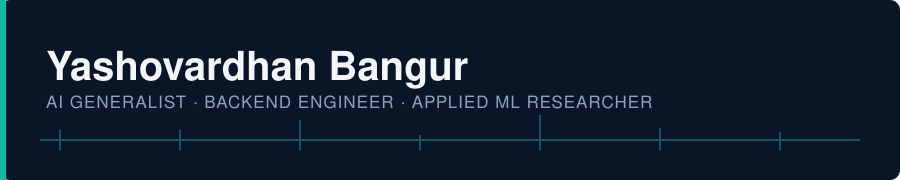
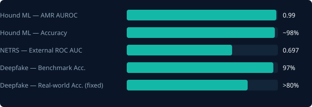
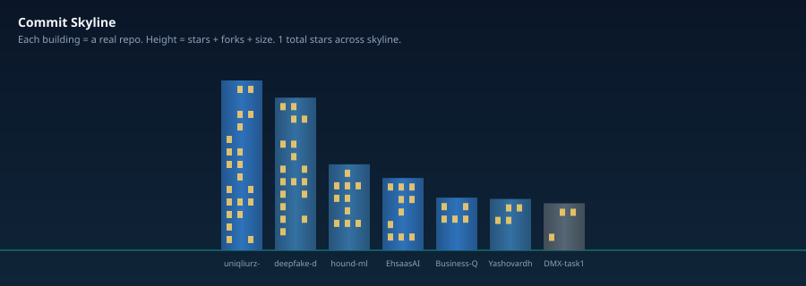

 

  

<!--STATS-START-->

**7** public repos · **1** stars total
Top languages: TypeScript (3) · Python (3)

Last updated 2026-07-17 UTC

<!--STATS-END-->

 

Stats/streak run on shared public servers and occasionally load slowly — that's the server, not your GitHub data.

---

Animated from real commit history via <a href=".github/workflows/snake.yml">snake.yml</a> — appears after the first Action run.

---

## About

AI Generalist, Backend Engineer, and Applied ML Researcher — incoming MSc Artificial Intelligence
at the University of Bristol (Sept 2026). I work at the intersection of production AI engineering
and interpretable applied research: architecting backend systems that ship, and building ML
pipelines that hold up to scrutiny.

- 🔭 Building **DealMatch** — a B2B real estate broker-matching platform with an explainable AI
  "gravity score" engine
- 🧬 Researching antimicrobial resistance prediction and NSCLC prognostic signatures with
  interpretable ML on genomic data
- 🎓 Starting an MSc in Artificial Intelligence at the University of Bristol, September 2026
- 📝 First author, *"Hello History: AI Chatbot for Real-Time Interaction With Historical
  Personalities"* (IFERP, 2025)

## Experience

**Founding Backend Engineer — DealMatch** · Jan 2026 – Present
Architected a modular-monolith backend (Node.js, TypeScript, PostgreSQL on AWS RDS) for an
invite-only broker network in the Mumbai Metropolitan Region. Built a semantic "gravity" matching
engine (OpenAI gpt-4o-mini, 65/35 deterministic weighting) with explainable match reasoning.
Passed four technical audit rounds; earned board approval for a 1.00% equity milestone.

**AI Generalist Intern — Uniqliurz** · Oct 2025 – Mar 2026
Built AI automation pipelines (Python, Gemini API) that cut physical material waste by **40%**.
Shipped internal dashboards (Next.js, tRPC, Prisma) for content and business data management.

**Unreal Engine Intern — Tribal Gorilla** · Jul 2025 – Sep 2025
Optimized 3D animation rendering pipelines in Unreal Engine 5; built procedural generation
workflows with Niagara VFX and Mixamo.

## Featured Projects

| Project | What it does | Stack | Result |
|---|---|---|---|
| **[DealMatch](https://github.com/YashovardhanB28)** — B2B real estate matchmaking | Explainable AI broker-matching platform | Node.js, TypeScript, PostgreSQL, AWS, OpenAI | Passed 4 audit rounds, 1.00% equity milestone |
| **[Hound ML](https://github.com/YashovardhanB28/hound-ml)** — genomic AMR prediction | Predicts antibiotic resistance from *E. coli* genomes | Python, scikit-learn, AMRFinderPlus | 90–96% accuracy, biologically interpretable features |
| **Ehsaas.AI** — real-time AI video SaaS | Video conferencing with interactive AI agents + live transcript search | Next.js, OpenAI Realtime API, Stream Video SDK, tRPC | Full-stack, production-deployed |
| **Hello History** — RAG chatbot SaaS | Chat with historical personalities via long-term memory | Next.js, LangChain, Pinecone, Llama 2, Prisma | Published paper, IFERP 2025 |

## Featured Research

| Project | Summary | Result |
|---|---|---|
| [Hound ML](https://github.com/YashovardhanB28/hound-ml) | AMR prediction in *E. coli* genomes | ~90–96% acc. (gene-based), up to 98.6% (label-scale baseline) |
| [NETRS Signature](docs/RESEARCH.md#netrs-signature) | 18-gene NSCLC prognostic signature | HR = 2.92, p = 0.001 |
| [Deepfake Forensics](docs/RESEARCH.md#deepfake-forensics) | Generalization gap analysis | 97%→30%→80%+ (fixed) |

 Generated from <code>scripts/generate_research_chart.py</code> — pulls directly from the numbers in docs/RESEARCH.md, not a template.

Full write-ups, methodology, and figures: [`docs/RESEARCH.md`](docs/RESEARCH.md)

## Certifications

- Google Cloud Certified Professional Cloud Architect (2024)
- Outskill AI Generalist Fellowship — Level 5 (Oct 2025 – Mar 2026)
- Ajna Creator Program — Mixed Reality / XR (2025)
- Microsoft & LinkedIn: Azure AI Essentials, Ethics in Generative AI (Dec 2025)

## Tech Stack

**Languages** Python · TypeScript · JavaScript · SQL · C++ · R
**AI/ML** PyTorch · scikit-learn · LangChain · RAG · OpenAI & Gemini APIs · Grad-CAM · AMRFinderPlus · CellChat
**Backend/Cloud** Node.js · tRPC · PostgreSQL · Prisma · AWS (RDS, S3, IAM)
**Frontend** React · Next.js · Tailwind CSS

## Commit Skyline

A custom-built visualization, unique to this profile — not a copy of an existing badge service.
Each building is a real public repo; height is a log-scaled activity score (stars, forks, repo
size), color is the repo's primary language, and the lit-window pattern is deterministically
seeded from the repo name. Regenerated weekly by [`generate_skyline.py`](scripts/generate_skyline.py).

## This Repository

This profile repo keeps a few things up to date automatically instead of by hand:

- **Stats block above** — refreshed weekly via [`refresh-profile.yml`](.github/workflows/refresh-profile.yml)
- **Commit skyline** — regenerated in the same workflow from live repo data
- **Changelog** — [`CHANGELOG.md`](CHANGELOG.md) logs automated updates
- **Roadmap** — [`ROADMAP.md`](ROADMAP.md) is hand-maintained and honest about what's built vs. planned

See [`docs/ARCHITECTURE.md`](docs/ARCHITECTURE.md) for the fuller technical design and what's
implemented vs. speculative.

---

Feedback or collaboration on the research side — reach out.

